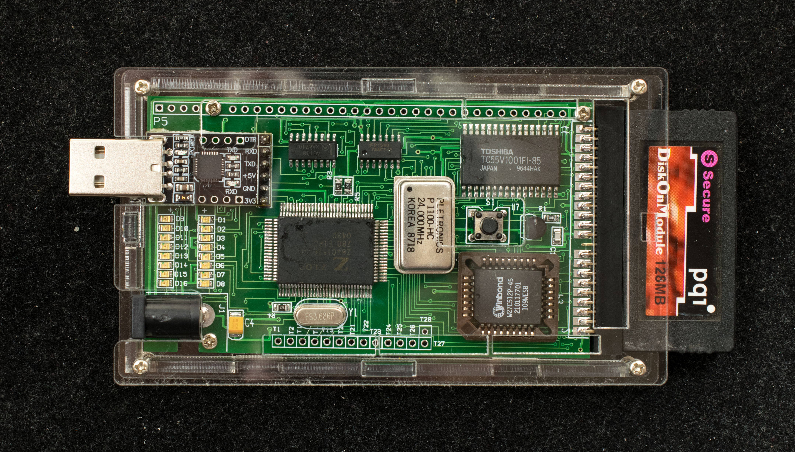
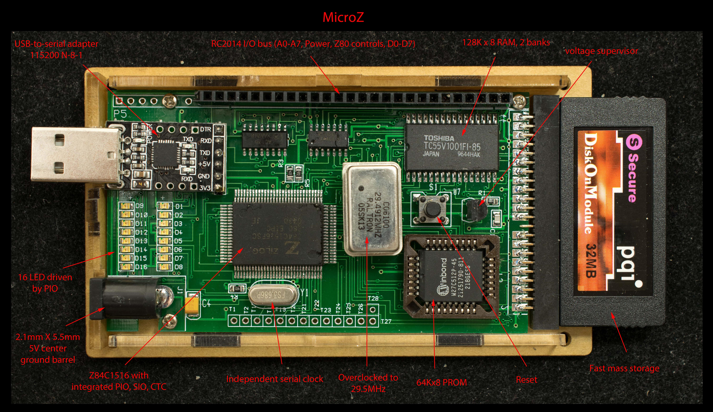

# MicroZ, CP/M-ready Z84C15 SBC for Arduino Mega Enclosure
### Introduction
MicroZ is a full-feature Z80 CP/M-capable SBC based on Z84C15 controller that fitted in the Arduino Mega2560 enclosure.  The design is based on Micro80.

### Features
- Z84C1516 Intelligent Peripheral Controller
  - Z80@16MHz, reliably overclocked to 24MHz
  - Two channel SIO
  - Four counter/timer
  - Clock generator
  - PIO
- 128K RAM in 2 banks
- 64K EPROM
- Expandable via RC2014 I/O bus
- Disk-on-module mass storage
- CP/M ready
- Designed for acrylic Arduino Mega enclosure

### Functions
This is a classical microprocessor design with EPROM and RAM. At reset the EPROM copies itself into RAM and then jump into RAM. The Z84C15 has two programmable chip selects that are used to page out the EPROM or change RAM banks.

### Design Information
- [Schematic](microz_r1_scm.pdf)
- [Gerber photoplots](microz_r1_1_gerber.zip)

### Software
- [MicroZ monitor](Software/microz_monitor_working_rev0_1.zip)
- [CP/M 2.2 BIOS/BDOS/CCP](Software/microz_cpm22_bios_bdos_ccp.zip)
- [CP/M 2.2 distribution](https://github.com/Plasmode/ZRCC/blob/main/rev1.0_rev1.1/software/cpm22dri.zip) files

### Manuals
Getting started with MicroZ

MicroZ Monitor manual

Installing software on a new DOM
